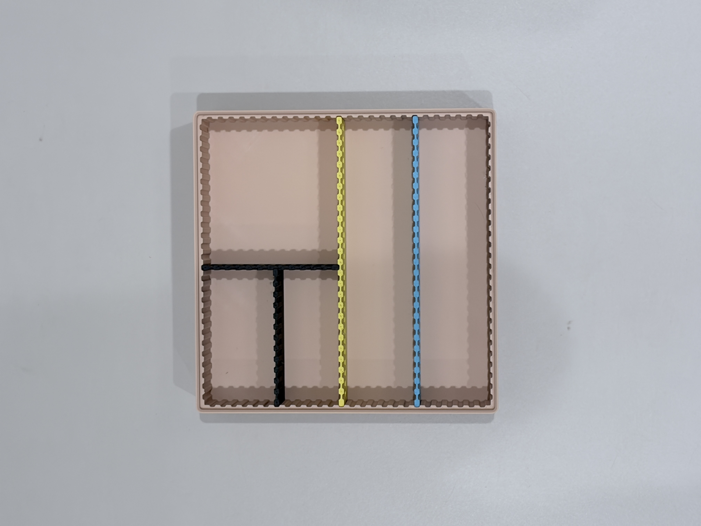
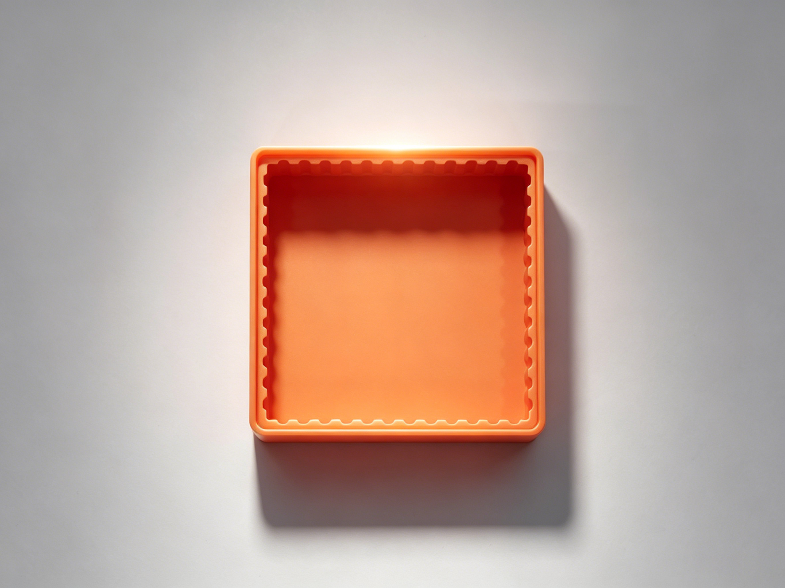

# Gridfinity 参数化收纳盒与分隔板

这是一个 Gridfinity 参数化收纳盒、分隔板和槽位规划工具的开源项目。

## 在线工具

打开 [Gridfinity 分隔板规划器](https://nexaio09.github.io/gridfinity-divider-planner/)，可以拖动生成分隔板并自动计算槽位数量和板长。

板长计算公式：

```text
分隔板长度 = 插槽数量 × 6 + 5 mm
```

## 参数

- Gridfinity 标准单格：42 mm
- 盒体实际外形：格数 × 42 - 0.5 mm
- 单个凹槽：3 × 1.1 mm
- 凹槽内侧圆角：R0.5
- 分隔板长度：插槽数量 × 6 + 5 mm

## 模型展示

### 分隔板组合示例



### 收纳盒外观




## 文件结构

```text
hardware/fusion360/   Fusion 360 参数化源文件
hardware/step/        STEP 通用 CAD 文件
index.html            在线规划工具静态网页（GitHub Pages 入口）
tutorial/             使用教程 GIF
```

`.f3d` 文件保留 Fusion 360 参数化历史；STEP 文件用于其他 CAD 软件交换。

将仓库启用 GitHub Pages 后，根目录的 `index.html` 即为网页工具入口。

## 使用教程


## 打印与修改

请根据打印机、材料和实际打印结果调整公差。修改 Fusion 360 参数后，建议同时重新导出 STEP 和 STL 文件。

## 许可证

- CAD 硬件模型：见 [LICENSE-MODEL.md](LICENSE-MODEL.md)
- 网页工具代码：见 [LICENSE](LICENSE)
